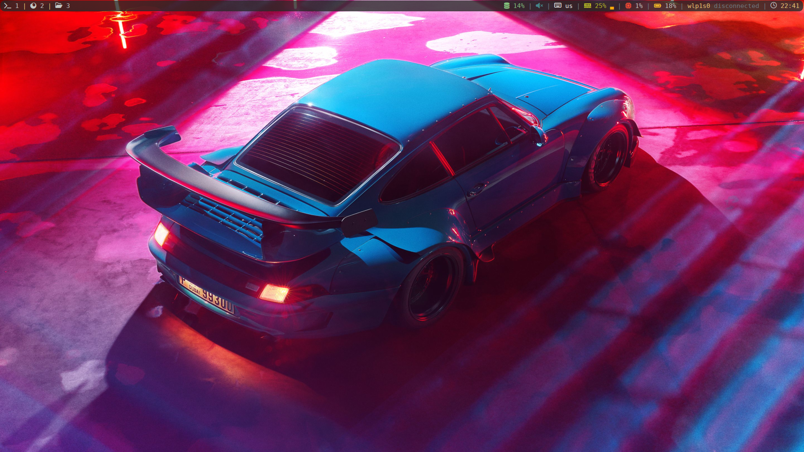
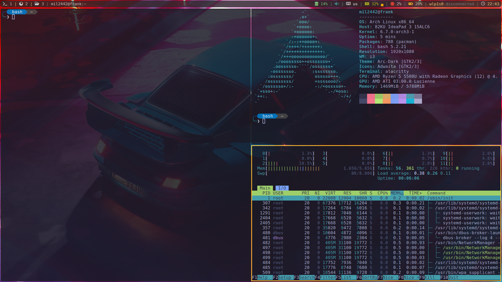
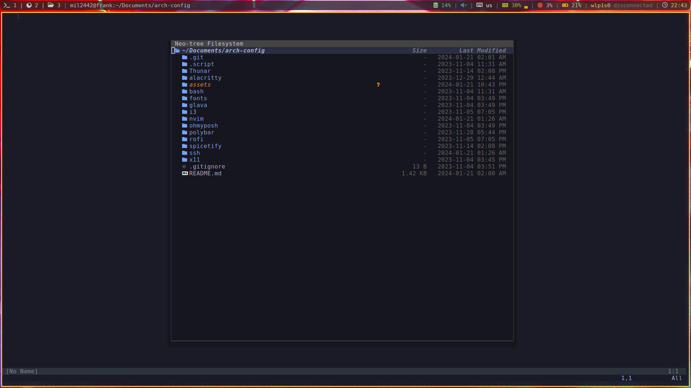
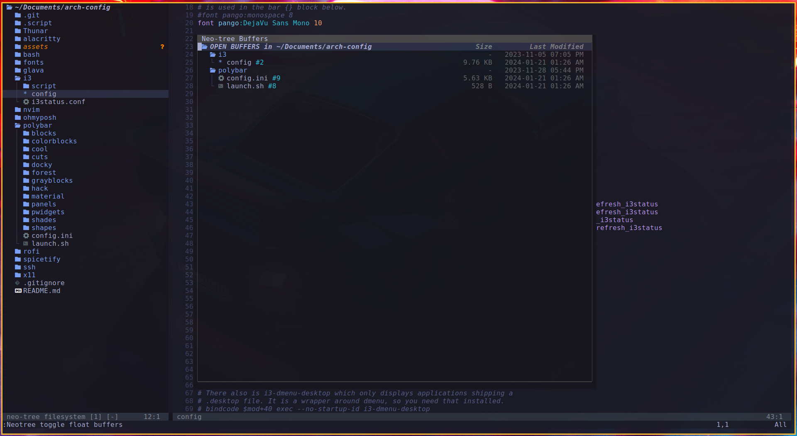
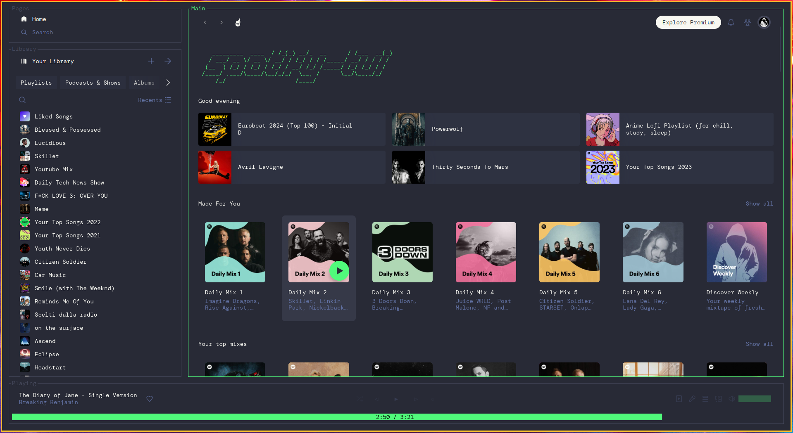

# Arch rice using i3

Hello, this is my first rice of arch using i3 window manager. I know it's pretty basic but I have not much confidence and knowledge of this things

<!--toc:start-->

- [Images](#images)
  - [Alacritty](#alacritty)
  - [Neovim](#neovim)
  - [Spotify theme](#spotify-theme)
- [What I've done](#what-ive-done)
- [I'm currently working on](#im-currently-working-on)
<!--toc:end-->

## Images

### Alacritty

### Neovim

### Spotify theme

## What I've done

In these configuration files you will find:

- Neovim configuration using Lazy plugin manager and Mason
- i3 with custom keybinds and settings
- Polybar configuration, even if is pretty standard
  (you can change the bar in the i3 config file and it will set a themed bar)
- Thunar config files (they still need work right now)
- Some bash aliases and ohmyposh configuration for a cool command line
- Alacritty configuration
- All my installed fonts
- Glava config for audio visualizer in all workspaces
- X11 configuration to start i3 window manager
- My spotify theme using spicetify
- Notifications using dunst daemon

## I'm currently working on

- [ ] upgrading polybar style and design
- [x] fixing neovim configuration because it's still not perfect but usable
- [ ] implementing more feature with i3
- [ ] better audio configuration
- [ ] customize Thunar file explorer
